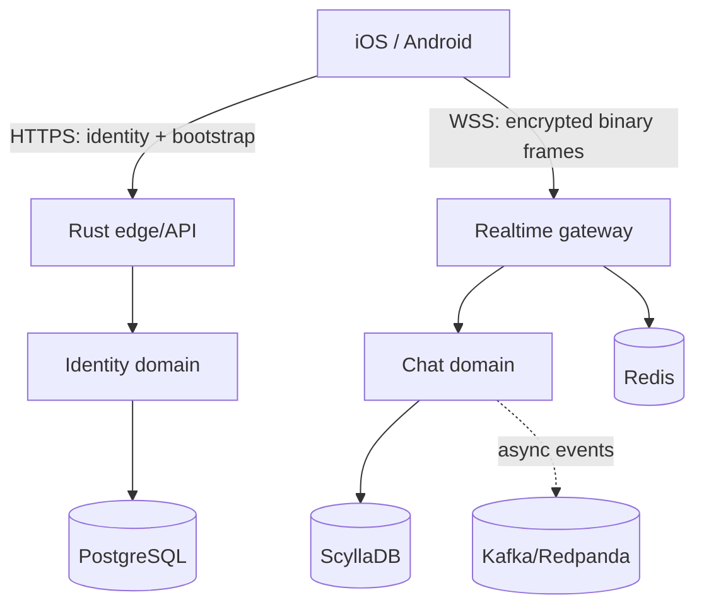

# TEKtalk Chat Learning Template

Reusable educational template for studying a mobile chat system with native iOS and Android clients, a Rust edge/API service, an MTProto 2.0 established-session encrypted envelope, PostgreSQL identity state, Redis ephemeral state, and extension points for ScyllaDB and Kafka-compatible events.

This is an independent educational reference implementation for TEK, not the production source code of any commercial messaging platform. It deliberately selects high-value Telegram engineering patterns without requiring official Telegram clients or the full Telegram API to interoperate with TEKtalk.

The selected protocol, client, server, sync, delivery and media patterns are tracked in `docs/telegram-engineering.md`. The AES-IGE/KDF codec is the active realtime encryption path and is covered by server tests and native client builds.

## Included vertical slice

- Register by phone number, set password, and store a security question/answer
- Password login; OTP is reserved for password recovery
- Unknown-device challenge using the security question
- Password reset through OTP and authenticated password change
- Short-lived access tokens plus rotating refresh tokens
- HTTPS REST for identity/bootstrap and encrypted WebSocket binary frames for realtime chat
- One-to-one message send, acknowledgement, deduplication, ordering, and history
- Native Kotlin/Android and Swift/iOS sample clients
- PostgreSQL migrations, Scylla schema, Redis/Kafka integration points
- Docker Compose local dependencies, Kubernetes manifests, OpenTelemetry hooks, and CI

## Architecture



The runnable Rust service keeps edge, identity, and realtime domains in one deployable for the first vertical slice, but their ports and modules are separated. Scale them independently by extracting modules behind the same interfaces. See `docs/architecture.md` and `docs/protocol.md`.

## Quick start

Requirements: Docker Desktop/Engine with Compose v2, OpenSSL and curl.

```bash
make local-up
```

This generates local secrets in the ignored `.env`, builds and starts the complete stack, waits for every service to become healthy, and runs an API smoke test. Health check: `curl http://localhost:8080/healthz`.

Use `make logs`, `make smoke`, and `make local-down`. `make local-reset` additionally deletes the local data volumes.

Run tests with `cargo test --workspace`. Android opens from `clients/android` in Android Studio. Add `clients/ios` files to an Xcode iOS App target and set `API_BASE_URL` and `REALTIME_URL` in its Info.plist.

For the complete learning setup, client instructions, verification commands, release flow, and Kubernetes deployment, see:

- `docs/getting-started.md`
- `docs/deployment.md`
- `docs/runbook.md`

## Security boundary

The realtime protocol uses the MTProto 2.0 established-session envelope, SHA-256 KDF and AES-256-IGE. Any public deployment still requires external cryptographic review of the selected auth-key bootstrap, device policy, protected server keys, certificate policy, abuse controls, and a formal threat model.

## Repository map

- `server/` Rust HTTPS and realtime service
- `protocol/mtproto-2.0.md` normative wire specification
- `clients/android/` Kotlin client core and Compose sample
- `clients/ios/` Swift client core and SwiftUI sample
- `infra/` database, Kubernetes, and observability configuration
- `docs/` architecture, authentication flows, runbook, and threat model
