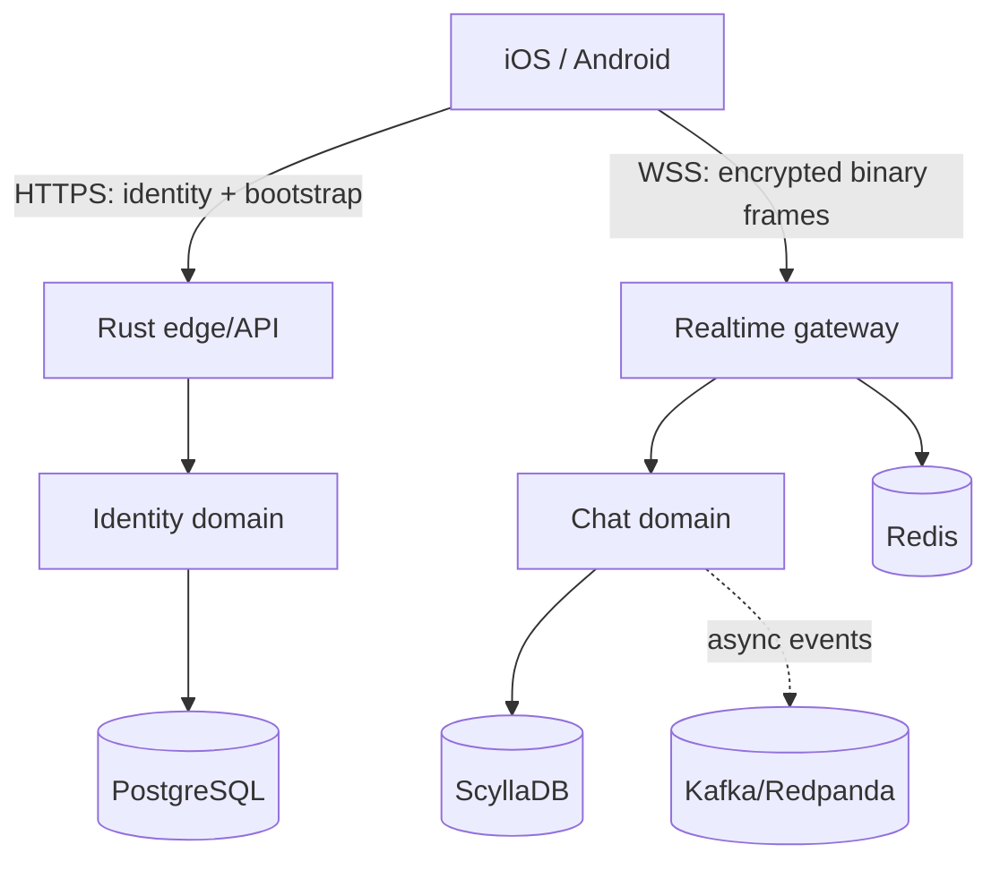

# TEKtalk Chat Reference Platform

Production-oriented reference skeleton for a Vietnamese mobile chat system with native iOS and Android clients, a Rust edge/API service, an MTProto 2.0 established-session encrypted envelope, PostgreSQL identity state, ScyllaDB message history, Redis ephemeral state, and Kafka-compatible events.

This is an independent educational reference implementation for TEK, not the production source code of any commercial messaging platform. Its realtime codec implements the MTProto 2.0 established-session envelope; full Telegram client interoperability still requires the standard RSA/DH bootstrap, service-message behavior, and Telegram TL schemas.

The remaining Telegram MTProto 2.0 compatibility work is tracked in `docs/mtproto-compatibility.md`. The AES-IGE/KDF codec is the active realtime encryption path and is covered by server tests and native client builds.

## Included vertical slice

- Register by phone number, set password, and store a security question/answer
- Password login; OTP is reserved for password recovery
- Unknown-device challenge using the security question
- Password reset through OTP and authenticated password change
- Short-lived access tokens plus rotating refresh tokens
- HTTPS REST for identity/bootstrap and encrypted WebSocket binary frames for realtime chat
- One-to-one message send, acknowledgement, deduplication, ordering, and history
- Native Kotlin/Android and Swift/iOS sample clients
- PostgreSQL migrations, Scylla schema, Redis/Kafka integration points
- Docker Compose local dependencies, Kubernetes manifests, OpenTelemetry hooks, and CI

## Architecture



The runnable Rust service keeps edge, identity, and realtime domains in one deployable for the first vertical slice, but their ports and modules are separated. Scale them independently by extracting modules behind the same interfaces. See `docs/architecture.md` and `docs/protocol.md`.

## Quick start

Requirements: Docker Compose v2 and Rust 1.82+.

```bash
cp .env.example .env
docker compose up -d postgres redis scylla redpanda
cargo run -p chat-server
```

Health check: `curl http://localhost:8080/healthz`

Run tests with `cargo test --workspace`. Android opens from `clients/android` in Android Studio. Add `clients/ios` files to an Xcode iOS App target and set `API_BASE_URL` and `REALTIME_URL` in its Info.plist.

## Security boundary

The realtime protocol now uses the MTProto 2.0 established-session envelope, SHA-256 KDF and AES-256-IGE. Production rollout still requires external cryptographic review, the standard RSA/DH authorization-key exchange, device attestation policy, HSM-backed server keys, certificate pinning policy, abuse controls, and a formal threat model.

## Repository map

- `server/` Rust HTTPS and realtime service
- `protocol/mtproto-2.0.md` normative wire specification
- `clients/android/` Kotlin client core and Compose sample
- `clients/ios/` Swift client core and SwiftUI sample
- `infra/` database, Kubernetes, and observability configuration
- `docs/` architecture, authentication flows, runbook, and threat model
