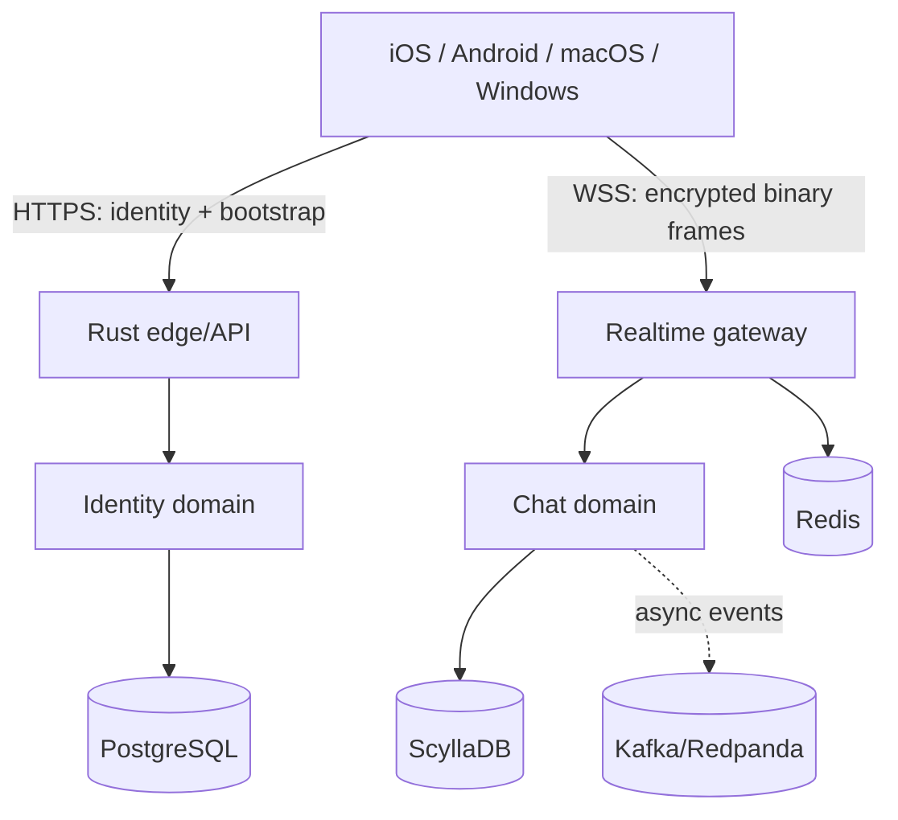

# TEKtalk Chat Learning Template

Reusable educational template for studying a mobile chat system with native iOS and Android clients, a Rust edge/API service, an MTProto 2.0 established-session encrypted envelope, PostgreSQL identity state, Redis ephemeral state, and extension points for ScyllaDB and Kafka-compatible events.

This is an independent educational reference implementation for TEK, not the production source code of any commercial messaging platform. Its public API, product model, components and branding are independently owned by TEKtalk.

The selected protocol, client, server, sync, delivery and media patterns are tracked in `docs/tektalk-engineering.md`. The AES-IGE/KDF codec is the active realtime encryption path and is covered by server tests and native client builds.

## Included vertical slice

- Register by phone number, set password, and store a security question/answer
- Password login; OTP is reserved for password recovery
- Unknown-device challenge using the security question
- Password reset through OTP and authenticated password change
- Short-lived access tokens plus rotating refresh tokens
- HTTPS REST for identity/bootstrap and encrypted WebSocket binary frames for realtime chat
- One-to-one message send, acknowledgement, deduplication, ordering, and history
- Native Android, iOS, macOS, and Windows clients with a shared Rust Core
- PostgreSQL migrations, Scylla schema, Redis/Kafka integration points
- Docker Compose local dependencies, Kubernetes manifests, OpenTelemetry hooks, and CI
- Independent gRPC services for account, OTT chat, L0/L1/L2 sessions, and consent
- Clean-room native registration, login, device verification and direct text chat UI for Android and iOS
- Shared Rust Core for Snowflake IDs, MTProto message IDs, envelope cryptography and transport framing
- Signed Valdi catalog with Message, AI and Me tabs, capability-gated host APIs and a sandboxed Mini-app SDK

## Architecture



The original Rust edge remains available for the first vertical slice. Account, OTT chat, session management and consent management also run as independent gRPC processes and containers, providing an executable migration path to the target microservice architecture. See `docs/architecture.md` and `protocol/mtproto-2.0.md`.

The target architecture uses domain-owned microservices with internal gRPC/Protobuf contracts, a native host with remotely delivered Valdi plugins, and a Rust shared core with a stable C ABI for deterministic cross-platform logic. See `docs/target-architecture.md`, `services/README.md`, `contracts/README.md`, `core/README.md`, and `plugins/README.md`.

## Quick start

Requirements: Docker Desktop/Engine with Compose v2, OpenSSL and curl.

```bash
make local-up
```

This generates local secrets in the ignored `.env`, builds and starts the complete stack, waits for every service to become healthy, and runs an API smoke test. Health check: `curl http://localhost:8080/healthz`. Internal gRPC endpoints are exposed locally on ports 50051–50055 for learning and integration tests; they must not be internet-facing in production.

Use `make logs`, `make smoke`, and `make local-down`. `make local-reset` additionally deletes the local data volumes.

Run tests with `cargo test --workspace`. Android opens from `clients/android` in Android Studio. Add `clients/ios` files to an Xcode iOS App target and set `API_BASE_URL` and `REALTIME_URL` in its Info.plist.

For the complete learning setup, client instructions, verification commands, release flow, and Kubernetes deployment, see:

- `docs/getting-started.md`
- `docs/deployment.md`
- `docs/runbook.md`

## Security boundary

The realtime protocol uses the MTProto 2.0 established-session envelope, SHA-256 KDF and AES-256-IGE. Any public deployment still requires external cryptographic review of the selected auth-key bootstrap, device policy, protected server keys, certificate policy, abuse controls, and a formal threat model.

## Repository map

- `server/` Rust HTTPS and realtime service
- `services/` target microservice boundaries and extraction plan
- `contracts/` versioned internal gRPC/Protobuf APIs
- `core/` shared Rust session, sync, networking and storage foundation with a stable C ABI
- `plugins/` signed Valdi plugin manifests and delivery contract
- `protocol/mtproto-2.0.md` normative wire specification
- `clients/android/` Kotlin client core and Compose sample
- `clients/ios/` Swift client core and SwiftUI sample
- `clients/macos/` native SwiftUI/AppKit desktop client
- `clients/windows/` native C++/WinRT and WinUI 3 desktop client
- `infra/` database, Kubernetes, and observability configuration
- `docs/` architecture, authentication flows, runbook, and threat model

Client production status and the remaining secure-storage, realtime, media, push and calling gates are tracked in `docs/client-production.md`.
