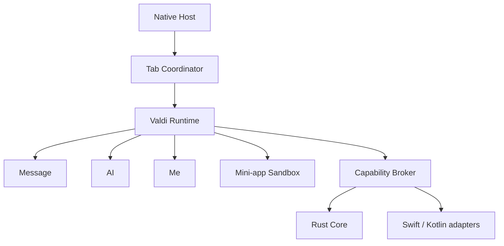

# Client, plugin and mini-app architecture

## Runtime boundary

The iOS and Android applications are native hosts. They own lifecycle, login fallback, root tab navigation, secure storage, OS permissions, push, background execution, WebRTC and recovery UI. Message, AI and Me are first-party Valdi tab plugins resolved from a signed catalog. Every release also bundles last-known-good Message and Me modules.

Rust Core is the source of truth for MTProto, session state, retry, sync, repository contracts, message identifiers and plugin security. Valdi code never receives auth keys, tokens, database handles, sockets or native objects.

## Trust and capability gates

A call is allowed only when the capability is declared by the signed manifest, granted by server entitlement, covered by user consent, permitted by the current L0/L1/L2 session and—where relevant—approved by the OS. Rust Core implements this decision as a pure function and native hosts enforce the result.

First-party tabs may request product capabilities. Third-party mini-apps use separate storage namespaces, domain allowlists, quotas and lower default trust. Security-sensitive confirmations such as revoking every device, changing credentials or granting L2 access always render in trusted native UI.

## Distribution lifecycle

Source is compiled by a pinned Valdi toolchain into an immutable `.valdimodule`. CI tests and scans it, computes SHA-256, and sends the digest to an isolated Ed25519 signing service. Registry catalogs are separately signed. The host downloads to staging, verifies catalog signature, artifact digest, artifact signature and compatibility, probes the entry point, then atomically promotes it. Repeated failures activate the bundled or cached last-known-good version.

Production publishing must reject empty artifact digests or signatures. The development registry intentionally returns metadata before an artifact pipeline is configured; it is not an artifact signer.

## Compatibility matrix

Every resolution checks host version, Rust Core ABI, Valdi runtime and plugin API. The host supports the current and immediately previous plugin API. Required tabs make catalog resolution fail when no compatible version exists; optional tabs can be omitted by rollout or entitlement.

## Rollout

Rollout is deterministic by `hash(device_id, plugin_id) % 100`, giving stable cohorts across catalog refreshes. Recommended waves are internal, 1%, 5%, 25%, 50% and 100%. Crash-free sessions, render latency, memory, capability denials, message-send success and sync gaps drive automatic rollback.

## Native desktop fallback

The Windows and macOS applications remain native hosts. When Valdi has no
supported desktop runtime, Message, AI and Me are native libraries distributed
by the same signed catalog:

| Host | Artifact | View returned by ABI |
| --- | --- | --- |
| Windows C++/WinRT | signed `.dll` | retained `IInspectable*` containing a WinUI `FrameworkElement` |
| macOS SwiftUI/AppKit | signed `.dylib` | retained `NSView*` |

Catalog resolution selects artifacts by platform, CPU architecture and
`native-abi-1`. Hosts download into non-executable staging, ask Rust Core to
verify SHA-256 and Ed25519, verify Authenticode or macOS code signing, perform a
health probe, then activate atomically. The previous library stays available
for rollback. A plugin is never loaded directly from the download directory.

The desktop ABI exposes a JSON capability bridge instead of raw application
objects. This preserves the same consent, entitlement and L0/L1/L2 checks used
by Valdi. Message and Me also ship as bundled last-known-good libraries so a
bad catalog cannot make the host unusable.
