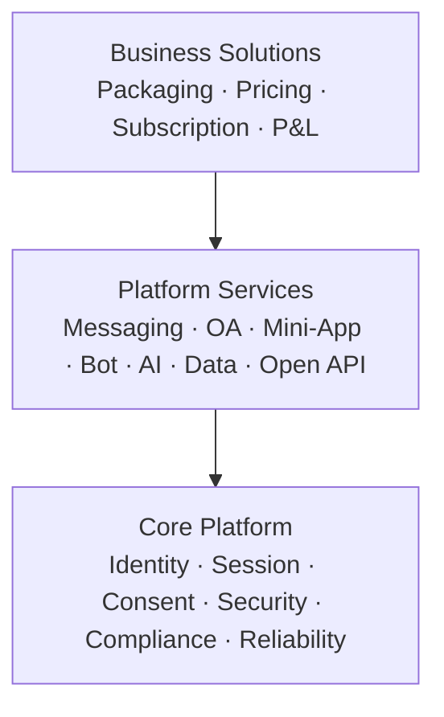

# TEKtalk platform and product architecture

## Operating model

TEKtalk uses three explicit layers. Dependencies point downward; commercial
products consume platform capabilities, and platform capabilities consume the
trusted core. A lower layer must never depend on pricing, packaging or a named
commercial plan.

| Layer | Owns | Does not own |
|---|---|---|
| Core Platform | identity, trusted profile, auth/session, consent, privacy, security controls, audit and reliability control plane | user-facing packaging or price |
| Platform Services | reusable APIs, runtimes, SDKs and ecosystem capabilities | subscriptions, commercial bundles or P&L |
| Business Solutions | catalog, offers, subscriptions, entitlement composition, billing integration, commercial SLA and P&L | identity truth or implementation of platform capabilities |

## Server bounded contexts

### Core Platform — Trust & Foundation

- `identity-profile`: global identifier and trusted profile source.
- `signin-signup`: credentials, authentication and device challenge.
- `session-management`: L0/L1/L2 session, audience, scope and token lifecycle.
- `consent-management`: purpose-bound first- and third-party grants.
- `security-control`: policy, audit, key management, fraud and abuse signals.

### Platform Services — Ecosystem Enablement

- `conversation`, `chat`, `sync`, `media`, `notification`.
- `oa`, `channel`, `bot`, `miniapp-runtime` and `plugin-registry`.
- `openapi-gateway`, SDK distribution and developer portal.
- `ai-platform` and `data-platform` as reusable capabilities.

### Business Solutions — Commercial Products

- `product-catalog`: uVAS/eVAS plans and capability composition.
- `subscription`: lifecycle, trial, renewal, cancellation and grace period.
- `entitlement`: effective rights for a user or enterprise subject.
- `billing-adapter`: payment-provider isolation, invoice and reconciliation.

The first implementation slice is `services/product-catalog`. It owns no
payment credentials and does not duplicate authorization. At runtime an edge
request must pass all independent gates: session authorization, applicable
consent, and commercial entitlement.

## Product portfolio

| Family | Segment | Initial products | Platform capabilities composed |
|---|---|---|---|
| uVAS | individual user | Premium, Professional/Creator | extended messaging, storage, AI, creator channel |
| eVAS | enterprise/partner | OA Business, Mini-App Business | OA, bot, mini-app commerce, Open API, analytics |

`Business Account` belongs to eVAS. The technical Mini-App runtime and catalog
belong to Platform Services; marketplace pricing, commission and subscription
belong to Business Solutions.

## Delivery sequence

1. **Foundation:** separate Core ownership in deployment labels and service
   catalog without changing public endpoints.
2. **Product control plane:** deploy catalog and entitlement read APIs; clients
   render eligible features but keep server-side enforcement authoritative.
3. **Subscription:** introduce lifecycle and billing adapters using an outbox;
   no distributed dual writes.
4. **Ecosystem products:** enable OA Business and Mini-App Business with quotas,
   metering and commercial SLA.
5. **Scale:** split hot services and data stores by measured load, not by the
   organization chart; preserve gRPC contracts and event compatibility.

## Ownership and SRE

- Core Platform defines trust, privacy and security guardrails.
- Every service team owns its production SLO, dashboards, runbook and on-call.
- Central SRE provides the paved road: observability, database reliability,
  deployment policy, disaster recovery and incident coordination.
- Product teams own adoption, conversion, retention, revenue and cost-to-serve;
  platform teams own availability, latency, developer adoption and unit cost.

