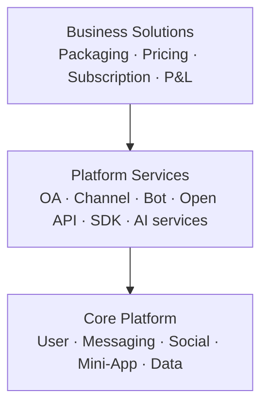

# TEKtalk platform and product architecture

## Operating model

TEKtalk uses three explicit product layers. The first delivery phase builds the
core platforms; it does not collapse or replace the three-layer model.
Dependencies point downward, and a lower layer must never depend on pricing,
packaging or a named commercial plan.

| Layer | Owns | Does not own |
|---|---|---|
| Core Platform | User, Messaging, Social, Mini-App and Data platforms plus security, privacy, compliance, audit and reliability foundations | user-facing packaging or price |
| Platform Services | reusable APIs, runtimes, SDKs and ecosystem capabilities | subscriptions, commercial bundles or P&L |
| Business Solutions | catalog, offers, subscriptions, entitlement composition, billing integration, commercial SLA and P&L | identity truth or implementation of platform capabilities |

## Core Platform topology — current build focus

| Platform | Authoritative ownership | Initial independently scalable services |
|---|---|---|
| User Platform | identifiers and profiles for User/OA/Channel/Bot, privacy settings, sessions and consent | `identity-profile`, `signin-signup`, `session-management`, `consent-management`, `privacy-policy` |
| Messaging Platform | conversations, membership, messages, media references, sync cursors and calls | `conversation`, `message`, `sync`, `media`, `call-signaling`, `notification` |
| Social Platform | friend graph, follow graph, group/community membership and moderation | `friend`, `follow`, `community`, `moderation`, `recommendation` |
| Mini-App Platform | application registry, signed artifacts, capability policy, rollout and developer environments | `plugin-registry`, `miniapp-runtime`, `developer-portal`, `openapi-gateway` |
| Data Platform | governed event ingestion, lakehouse datasets, lineage, audience segments and activation policy | `event-ingestion`, `catalog-lineage`, `audience`, `activation` |

The User Platform is the single source of truth for principals and profiles.
The Social Platform owns relationships. The Messaging Platform treats a direct
conversation as a two-member conversation, rather than a separate storage
model. Data products consume versioned events and must enforce consent both
when a segment is built and when it is activated.

All synchronous internal calls use gRPC. Cross-platform state propagation uses
versioned events and an outbox; no service reads or writes another service's
database. Public bootstrap and control APIs use HTTPS. Realtime chat prefers
raw TCP and falls back to WSS. Call signaling uses the realtime plane while
audio/video media uses a dedicated WebRTC-compatible media plane.

## Server bounded contexts

### Core Platform — Platforms & Foundation

- `identity-profile`: global identifier and trusted profile source.
- `signin-signup`: credentials, authentication and device challenge.
- `session-management`: L0/L1/L2 session, audience, scope and token lifecycle.
- `consent-management`: purpose-bound first- and third-party grants.
- `security-control`: policy, audit, key management, fraud and abuse signals.
- `conversation`: unified direct/group membership and permissions.
- `message`, `sync`, `media`, `call-signaling` and `notification`.
- `friend`, `follow`, `community`, `moderation` and `recommendation`.
- `plugin-registry`, `miniapp-runtime` and developer control plane.
- `event-ingestion`, governed lakehouse and consent-aware audience activation.

### Platform Services — Ecosystem Enablement

- OA, Channel and Bot products built on Core principals, Messaging and Social.
- Open API, SDK and partner integration capabilities.
- AI services and governed data products exposed to internal product teams and
  approved partners.
- Mini-App Store discovery and ecosystem operations. Runtime, signing and
  distribution remain Core Platform responsibilities.

### Business Solutions — Commercial Products

- `product-catalog`: uVAS/eVAS plans and capability composition.
- `subscription`: lifecycle, trial, renewal, cancellation and grace period.
- `entitlement`: effective rights for a user or enterprise subject.
- `billing-adapter`: payment-provider isolation, invoice and reconciliation.

The first implementation slice is `services/product-catalog`. It owns no
payment credentials and does not duplicate authorization. At runtime an edge
request must pass all independent gates: session authorization, applicable
consent, and commercial entitlement.

## Product portfolio

| Family | Segment | Initial products | Platform capabilities composed |
|---|---|---|---|
| uVAS | individual user | Premium, Professional/Creator | extended messaging, storage, AI, creator channel |
| eVAS | enterprise/partner | OA Business, Mini-App Business | OA, bot, mini-app commerce, Open API, analytics |

`Business Account` belongs to eVAS. The technical Mini-App runtime and catalog
belong to Platform Services; marketplace pricing, commission and subscription
belong to Business Solutions.

## Delivery sequence

1. **Core foundation:** deliver User, Messaging, Social, Mini-App and Data
   platform contracts, identity/security controls, gRPC, eventing and SRE paved
   road without changing stable public endpoints.
2. **Core runtime:** make the end-to-end identity, conversation/message,
   relationship, signed mini-app and governed event flows production-ready.
3. **Product control plane:** deploy catalog and entitlement read APIs; clients
   render eligible features but keep server-side enforcement authoritative.
4. **Subscription:** introduce lifecycle and billing adapters using an outbox;
   no distributed dual writes.
5. **Ecosystem products:** enable OA Business and Mini-App Business with quotas,
   metering and commercial SLA.
6. **Scale:** split hot services and data stores by measured load, not by the
   organization chart; preserve gRPC contracts and event compatibility.

## Ownership and SRE

- Core Platform defines trust, privacy and security guardrails.
- Every service team owns its production SLO, dashboards, runbook and on-call.
- Central SRE provides the paved road: observability, database reliability,
  deployment policy, disaster recovery and incident coordination.
- Product teams own adoption, conversion, retention, revenue and cost-to-serve;
  platform teams own availability, latency, developer adoption and unit cost.

