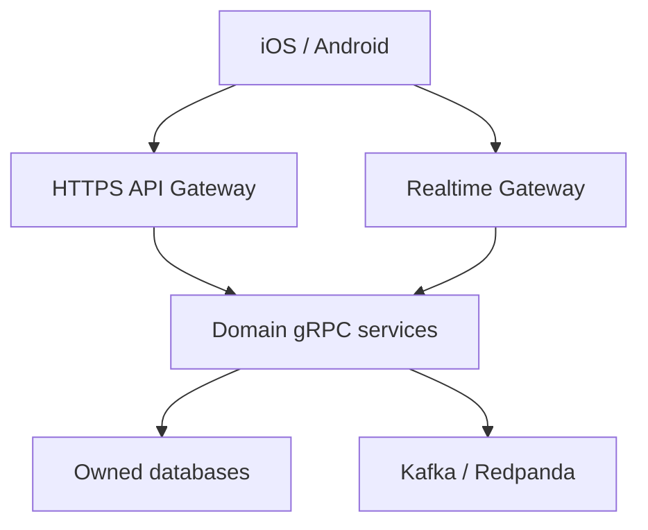
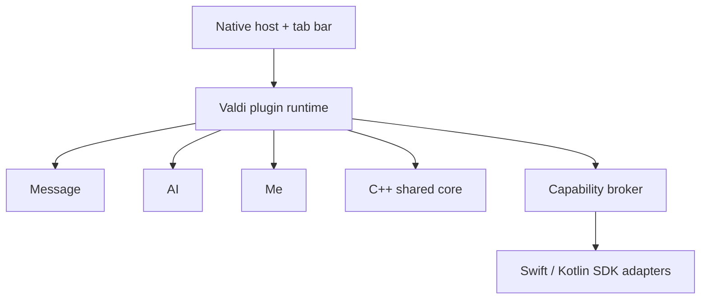

# TEKtalk target architecture

## Server

TEKtalk evolves from the runnable modular monolith into domain-owned microservices. Mobile clients use HTTPS, MTProto realtime and media HTTPS endpoints. Internal synchronous calls use gRPC/Protobuf; Kafka-compatible events handle fan-out and non-blocking side effects.

Service boundaries and ownership are defined in `services/README.md`; wire contracts live in `contracts/proto`.

### gRPC rules

- Propagate request ID, trace context and the earliest deadline.
- Retry only idempotent calls and apply bounded exponential backoff.
- Use mTLS workload identity between services.
- Maintain backward-compatible fields within `tektalk.v1`; create a new package for breaking changes.
- Never expose internal gRPC endpoints directly to mobile clients.
- Never share a database schema across services.

## Client host and plugins

The native host owns lifecycle, root navigation, authentication, plugin loading, telemetry and capability authorization. Message, AI and Me are independently versioned Valdi plugins rendered as the three primary tabs.

The registry distributes a signed catalog. Artifacts are immutable and content-addressed. The host verifies signatures and digests, stages installations, probes health, atomically promotes a version, and rolls back to a last-known-good module after repeated failure.

## Shared core

C++20 owns deterministic cross-platform behavior: protocol/session state, message state machines, retry policy, sync reconciliation, repository interfaces and media chunking. A stable C ABI is exposed to Objective-C++/Swift and JNI/Kotlin. OS networking, secure storage, background execution, camera, location and notifications remain native adapters.

## Capability security

Plugins declare capabilities in their manifests. The host combines manifest declarations, server entitlement and user permission before invoking a native adapter. Plugins never receive raw auth keys, access tokens, database handles, sockets or native object references.
